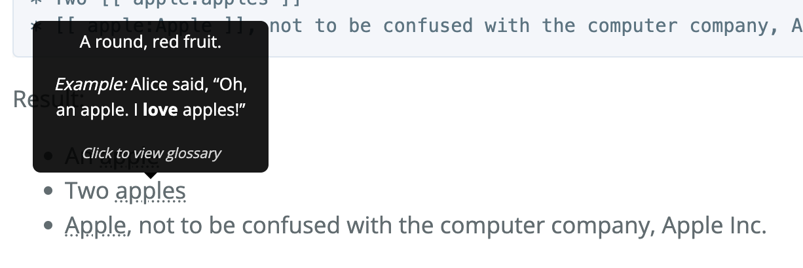

# jekyll-showcase

A showcase of my Jekyll creations. Most of these (except ["fancy tables"](https://github.com/RichDom2185/jekyll-fancy-tables)) were co-developed together with _[FoodRem](https://github.com/RichDom2185/tp)_, a school project undertaken in late 2022, as part of my efforts to streamline our team's developer experience with regards to documentation.

This repository simply consolidates all of my Jekyll creations into one place; feel free to browse through each submodule's repository for more information.

## Contents

All of the below submodules do not require extra gems, and are therefore **GitHub Pages-compatible**. This means that you don't have to pre-generate your Jekyll sites before pushing them to GitHub Pages.

Ocassionally, I may add more Jekyll creations to this repository. For now, the following are available:

### [jekyll-admonitions](https://github.com/RichDom2185/jekyll-admonitions)

A Jekyll plugin that allows you to create admonition boxes easily, supporting full Markdown syntax within those boxes.

<table>
<thead>
<tr>
<th>Example 1</th>
<th>Example 2</th>
</tr>
</thead>
<tbody>
<tr>
<td>

Markdown code like this...

````markdown
```note
This is a note, which is something **you should probably remember**.
```
````

becomes HTML like this...

> **Note**
> This is a note, which is something **you should probably remember**.

<!-- <div class="admonition admonition-type-note">
  <p class="admonition-title">NOTE</p>
  <p>
    This is a note, which is something <strong>you should probably remember</strong>.
  </p>
</div> -->

</td>

<td>

Markdown code like this...

````markdown
```warning
Don't ever run `rm -rf /` _unless_ you know what you are doing.
```
````

becomes HTML like this...

> **Warning**
> Don't ever run `rm -rf /` _unless_ you know what you are doing.

<!-- <div class="admonition admonition-type-danger">
  <p class="admonition-title">DANGER</p>
  <p>
    Don’t ever run <code class="language-plaintext highlighter-rouge">rm -rf /</code> <em>unless</em> you know what you are doing.
  </p>
</div> -->

</td>
</tr>
</tbody>
</table>

### [jekyll-auto-tooltips](https://github.com/RichDom2185/jekyll-auto-tooltips)

A Jekyll plugin that allows you to create custom, reusable, no-JavaScript tooltips using an easy-to-write syntax.

<table>
<thead>
<tr>
<th>Example 1</th>
</tr>
</thead>
<tbody>
<tr>
<td>

Markdown code like this...

```markdown
* An [[ apple ]]
* Two [[ apple:apples ]]
* [[ apple:Apple ]], not to be confused with the computer company, Apple Inc.
```

becomes HTML like this...


</td>
</tr>
</tbody>
</table>

### [jekyll-fancy-tables](https://github.com/RichDom2185/jekyll-fancy-tables)

A Jekyll plugin that allows you to create tables with a bit more flair than the default Markdown table syntax.

<table>
<thead>
<tr>
<th>Example 1</th>
<th>Example 2</th>
</tr>
</thead>
<tbody>
<tr>
<td>

Markdown code like this...

````markdown
```table
| OMG, I span 3 columns! \      \      |
|------------------------|------|------|
| That's...              | very | nice |
```
````

becomes HTML like this...

<table>
  <thead>
    <tr>
      <th colspan="3" data-nth-cell="1" align="left">OMG, I span 3 columns!</th>
    </tr>
  </thead>
  <tbody>
    <tr>
      <td colspan="1" rowspan="1" data-nth-cell="2" align="left">That’s…</td>
      <td colspan="1" rowspan="1" data-nth-cell="3" align="left">very</td>
      <td colspan="1" rowspan="1" data-nth-cell="4" align="left">nice</td>
    </tr>
  </tbody>
</table>

</td>

<td>

Markdown code like this...

````markdown
```table
|------------------------|---------|
| Look, I span two rows! | Looks   |
| ^^                     | pretty! |
```
````

becomes HTML like this...

<table>
  <tbody>
    <tr>
      <td colspan="1" rowspan="2" data-nth-cell="1" align="left">Look, I span two rows!</td>
      <td colspan="1" rowspan="1" data-nth-cell="2" align="left">Looks</td>
    </tr>
    <tr>
      <td colspan="1" rowspan="1" data-nth-cell="3" align="left">pretty!</td>
    </tr>
  </tbody>
</table>

</td>
</tr>
</tbody>
</table>

### [jekyll-plantuml](https://github.com/RichDom2185/jekyll-plantuml)

A Jekyll plugin that adds support for `puml` and `plantuml` language tags in Markdown code blocks, allow you to easily embed PlantUML diagrams into your Jekyll sites without having to generate the images manually.

Note that this plugins requires JavaScript to be running in your site visitors' brwosers in order to dynamically generate the PlantUML diagrams on page load.

<table>
<thead>
<tr>
<th>Example 1</th>
<th>Example 2</th>
</tr>
</thead>
<tbody>
<tr>
<td>

Markdown code like this...

````markdown
```puml
Alice -> Bob: Hi there!
Bob --> Alice: Hello to you too!
```
````

becomes HTML like this...


</td>

<td>

Markdown code like this...

<sup>\*</sup>Example 2 adapted from [SE-EDU's PlantUML guide](https://se-education.org/guides/tutorials/plantUml.html).

````markdown
```plantuml
A -up-> Z
B -up-> Z
C -up-> Z
D -up-> Z

A --> 1
B --> 2
C --> 3
D --> 4

'Force B C A D
B -right[hidden]- C
C -right[hidden]- A
A -right[hidden]- D
```
````

becomes HTML like this...


</td>
</tr>
</tbody>
</table>
